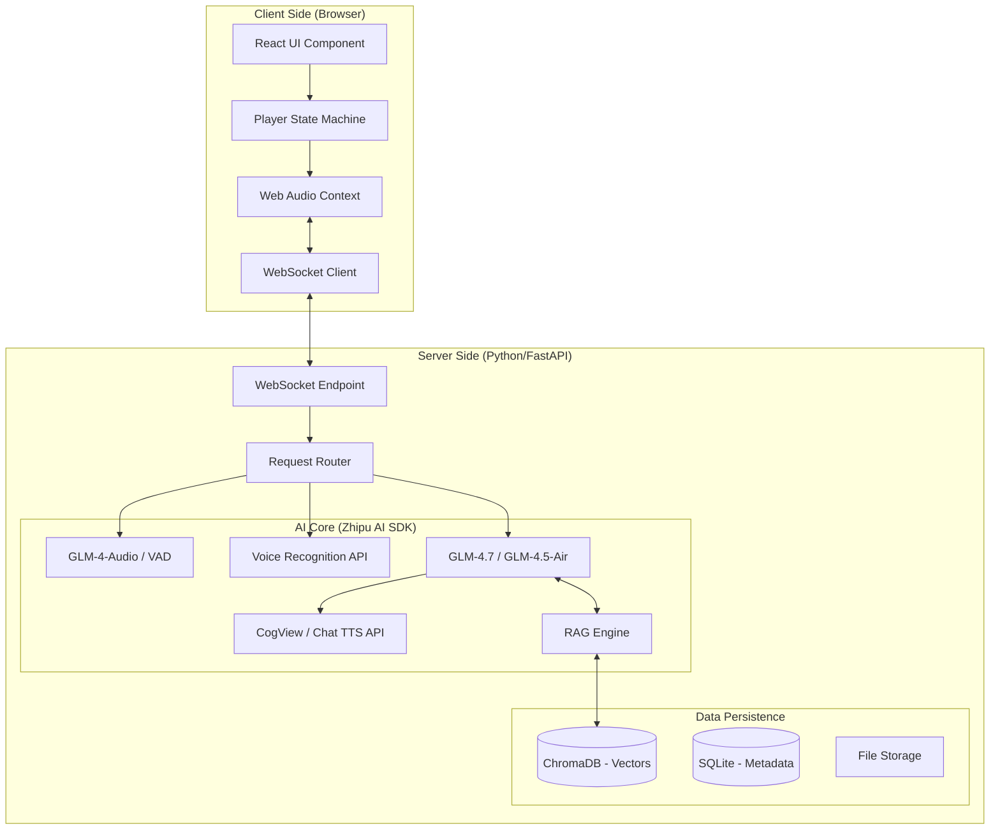

```markdown
# 技术架构方案 (TDD) - 灵境·AI 自适应数字讲解系统 (GLM-4.7 版)
**Lingjing AI Smart Narrator (Lite Edition) - Technical Design Document**
| 属性 | 内容 |
| :--- | :--- |
| **项目名称** | Lingjing-Lite (GLM-4.7 Integration) |
| **版本号** | v1.2.0 |
| **日期** | 2026-01-11 |
| **核心技术栈** | React 18, FastAPI, LangChain, WebSocket, ChromaDB, **ZhipuAI SDK (GLM-4.7)** |
---
## 1. 系统架构概述 (System Architecture)
本系统采用 **B/S (Browser/Server)** 架构，通过 WebSocket 实现低延迟的语音交互流。所有 AI 能力（LLM, Embedding, ASR, TTS）统一接入 **智谱 AI 开放平台 (BigModel.cn)**，核心文本模型采用 **GLM-4.7**。
### 1.1 架构图 (Mermaid)

---
## 2. 技术栈详细选型 (Tech Stack)
### 2.1 前端 (Frontend)
* **构建工具:** Vite + TypeScript
* **核心框架:** React 18
* **状态管理:** **Zustand** (用于管理复杂的播放器状态机)
* **UI 组件:** TailwindCSS + Shadcn/UI
* **视觉呈现:**
    * `Reveal.js`: 处理 PPT/幻灯片流。
    * `Konva.js`: 处理图片上的动态高亮标注 (Hotspots)。
* **音频/通信:**
    * `Socket.IO-client`: 双向实时通信。
    * `Web Audio API`: 录音采样率转换 (48kHz -> 16kHz) 与播放。
### 2.2 后端 (Backend)
* **Web 框架:** **FastAPI** (Python 3.10+) - 原生支持 Async/Await，处理 WebSocket 性能极佳。
*   **AI 编排:** **LangChain** - 管理 Prompt Templates、RAG 检索链和 Agent逻辑。集成 `langchain-community` 中的 `ChatZhipuAI`。
* **SDK 依赖:** **`zhipuai` (Python SDK)** - 官方 SDK，用于统一调用 GLM 模型、Embedding、ASR 及 TTS。
* **向量数据库:** **ChromaDB** - 轻量级、本地文件存储，无需复杂运维。
* **AI 服务:**
    *   **大模型 (LLM):** `GLM-4.7` (复杂策展与深度问答) / `GLM-4.5-Air` (实时问答，追求速度)。
    *   **向量化:** `Embedding-3` (最新版，性能更优)。
    *   **语音识别 (ASR):** 智谱 `Voice Recognition` API (支持实时流/非实时)。
    *   **语音合成 (TTS):** 智谱 `TTS` API (支持多种音色与情感风格)。
---
## 3. 核心模块设计 (Core Modules)
### 3.1 模块 A：知识库管理 (KMS)
**功能:** 将非结构化文档转化为向量索引。
**处理流程:**
1.  **Ingestion:** 接收 PDF/Markdown。
2.  **Splitting:** 使用 `RecursiveCharacterTextSplitter` 按语义分块。
3.  **Embedding:** 调用 **ZhipuAI Embedding-3 API** 生成向量。
4.  **Storage:** 存入 ChromaDB，Collection 命名为 `lingjing_knowledge`。
### 3.2 模块 B：策展 Agent (The Curator)
**功能:** 基于 LangChain 与 ZhipuAI 的对话系统，生成讲解脚本。
**实现方式:**
使用 `langchain.chat_models.ChatZhipuAI` 类，初始化连接 `glm-4.7` 模型。
**System Prompt:**
> "你是灵境公司的专业策展人。你的任务是通过对话收集用户的演示需求（受众、时长、重点），并基于知识库检索相关内容，最终输出符合 JSON Schema 的讲解脚本。"
### 3.3 模块 C：运行时状态机 (Runtime State Machine)
**功能:** 前端播放器的核心控制逻辑。
| 状态 | 描述 | 触发变迁条件 |
| --- | --- | --- |
| **IDLE** | 空闲/等待开始 | 用户点击"Start" -> `NARRATING` |
| **NARRATING** | 播放 TTS 和 PPT | Zhipu ASR 检测到说话 -> `LISTENING` |
| **LISTENING** | 暂停播放，采集录音 | Zhipu ASR 检测到静音 -> `THINKING` |
| **THINKING** | 等待 AI 生成回答 (GLM-4.5-Air) | 收到 TTS 音频流 -> `ANSWERING` |
| **ANSWERING** | 播放回答音频 (Zhipu TTS) | 回答播放完毕 -> `RESUMING` |
| **RESUMING** | 恢复讲解上下文 | 自动/用户确认 -> `NARRATING` |
---
## 4. 数据结构规范 (Data Schemas)
### 4.1 讲解脚本 (Script JSON)
这是后端生成、前端执行的"剧本"。
```typescript
// Script Interface
interface PresentationScript {
  id: string;
  meta: {
    title: string;
    target_audience: string;
    estimated_duration: number;
  };
  timeline: ScriptNode[];
}
interface ScriptNode {
  seq_id: number;
  type: 'image' | 'video';
  url: string; // 媒体文件路径
  voice_text: string; // TTS 朗读文本
  voice_id?: string; // 指定音色 (对应 Zhipu TTS 的 voice 参数，如 'zhimingxuan')
  duration_ms: number; // 预估时长
  
  // 视觉高亮指令
  hotspots?: {
    time_offset: number; // 语音播放多少毫秒后触发
    x: number; // 百分比坐标
    y: number;
    width: number;
    height: number;
    style: 'blink' | 'border' | 'pulse';
  }[];
  
  // RAG 上下文标签 (用于提升问答准确率)
  rag_tags: string[]; 
}
```
### 4.2 WebSocket 通信协议
Endpoint: `ws://{host}/ws/runtime/session/{id}`
**Client -> Server (上行):**
```json
// 1. 发送音频数据 (Binary)
<PCM_DATA_16K_16BIT_MONO>
// 2. VAD 状态事件
{ "type": "vad_event", "status": "start" } // 开始说话
{ "type": "vad_event", "status": "end" }   // 说话结束
```
**Server -> Client (下行):**
```json
// 1. 控制指令
{ "type": "control", "command": "pause" } 
{ "type": "control", "command": "resume", "seek_time": 12000 }
// 2. 字幕/状态
{ "type": "subtitle", "text": "正在查询相关参数..." }
// 3. 回答音频 (Base64 或 Binary)
{ "type": "audio_stream", "chunk": "<Base64_Encoded_MP3>" }
```
---
## 5. 接口定义 (API Endpoints)
### 5.1 REST API (Management)
* `POST /api/v1/upload`: 上传文件 (PDF/Img/Video)。
* `POST /api/v1/curator/chat`: 发送用户消息，获取 Agent 回复 (调用 `GLM-4.7`)。
* `GET /api/v1/script/generate`: 触发脚本生成，返回 JSON。
### 5.2 WebSocket (Runtime)
* `WS /ws/runtime/{session_id}`: 处理实时语音流和控制信令。后端通过 `zhipuai` SDK 将音频流转发至智谱 ASR 接口。
---
## 6. 推荐项目目录结构 (Directory Structure)
```text
lingjing-lite/
├── client/                 # React Frontend
│   ├── src/
│   │   ├── components/     # UI Components (Player, Visualizer)
│   │   ├── stores/         # Zustand Stores (usePlayerStore)
│   │   ├── services/       # Socket.IO & API Services
│   │   └── hooks/          # useAudioRecorder, useVAD
│   └── package.json
│
├── server/                 # FastAPI Backend
│   ├── app/
│   │   ├── api/            # REST Routers
│   │   ├── core/           # Config & WebSocket Manager
│   │   ├── services/       # ZhipuAI Service Wrapper (LLM, ASR, TTS)
│   │   ├── langchain/      # Chains & Prompts (using ChatZhipuAI)
│   │   └── models/         # Pydantic Schemas
│   ├── data/               # ChromaDB storage
│   ├── uploads/            # Static files
│   └── requirements.txt    # 新增依赖: zhipuai, langchain-community
│
└── docker-compose.yml      # Deployment Config
```
---
## 7. 关键实现提示 (Development Tips)
1.  **ZhipuAI SDK 配置:**
    *   在 `server/app/core/config.py` 中配置 `ZHIPUAI_API_KEY`。
    *   建议封装 `ZhipuAIService` 类，统一管理 `GLM-4.7` (文本), `Embedding-3` (向量), `VoiceRecognition` (ASR), `TTS` (语音) 的调用。
2.  **VAD 与 ASR 结合:**
    *   方案 A：前端简单 VAD (能量检测) -> 检测到说话结束 -> 发送累积音频给后端 -> 后端调用智谱 `Voice Recognition` API（非实时/录音文件识别）。
    *   方案 B (推荐，低延迟)：后端建立 WebSocket 连接直接透传音频流至智谱实时语音识别接口（如果可用），或使用前端 VAD 切片后快速并发请求。
3.  **模型选择策略:**
    *   **策展阶段:** 使用 `GLM-4.7`，其强大的逻辑推理和长上下文理解能力能生成更精准、更具深度的讲解策略和脚本。
    *   **问答阶段:** 使用 `GLM-4.5-Air`，确保响应速度 < 3s 并降低成本。
4.  **TTS 音色配置:**
    *   智谱 TTS 提供多种音色（如 `zhimao`, `xiaoshuang` 等）。在生成 JSON 脚本时，根据策略（严肃/亲切）将 `voice_id` 字段映射为对应的智谱音色参数。
5.  **WebSocket 音频流:**
    *   前端录音通常是 44.1kHz/48kHz，发送前必须 Downsample 到 16kHz，以匹配智谱 ASR 模型的采样率要求，减少带宽并提升识别准确率。
```
